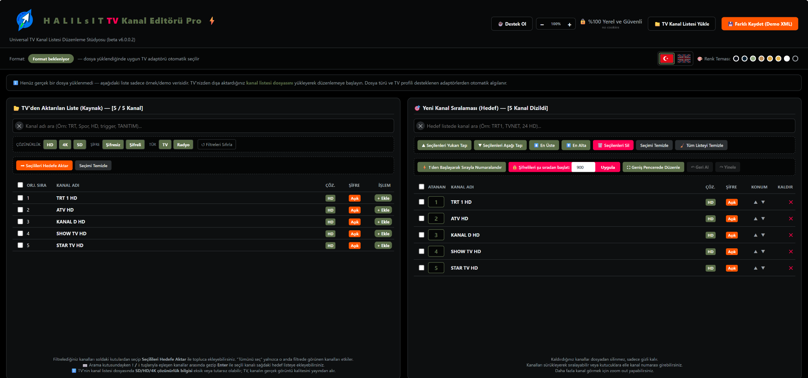
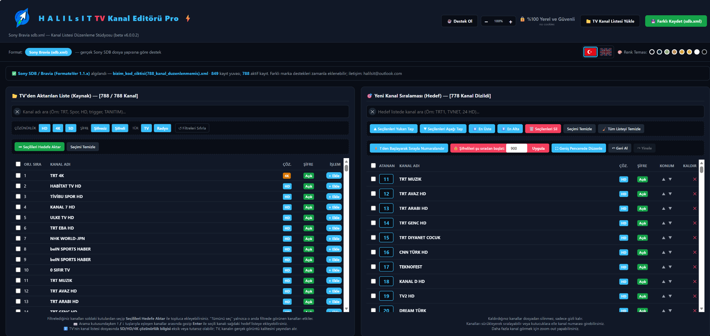
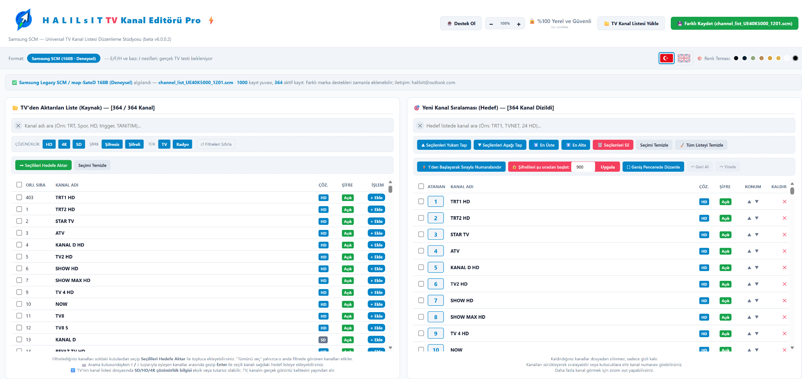
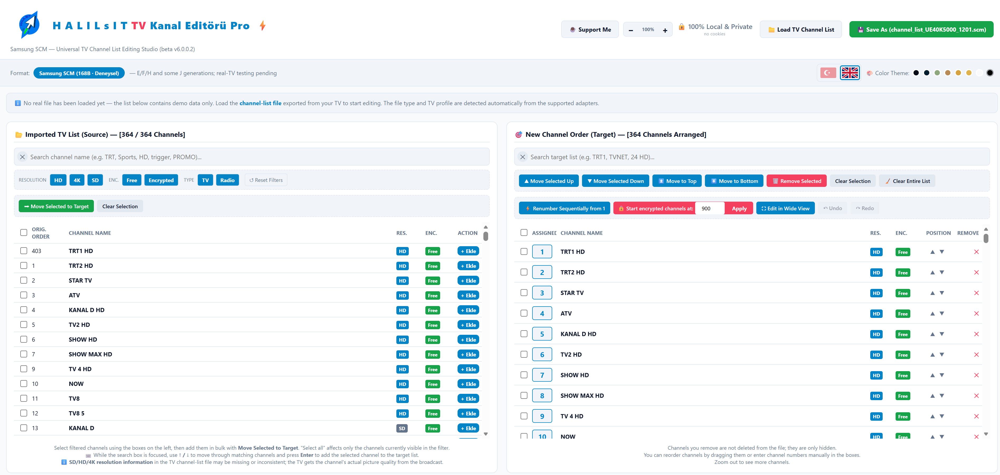

# TV Channel Editor Pro

Offline universal TV channel list editor for Sony, Samsung and LG TVs.

**Current beta:** `v6.1.0.0`

## Screenshots

### Demo / OLED Theme

### Sony Bravia — Real SDB File

Real Sony `sdb.xml` support has been validated on actual TV hardware.

### Samsung Legacy SCM — Experimental

Samsung Legacy SCM support is currently experimental and has not yet been validated on real Samsung TV hardware.

English interface example:

## Current Status

- Sony Bravia SDB support: validated on real TV hardware
- Samsung Legacy SCM support: experimental
- LG webOS `GlobalClone00001.TLL` support: experimental (beta v6.1)
- LG legacy binary `xx*.TLL` support: planned / under development
- Fully offline, single-file HTML application
- No cookies, no cloud processing, no external upload

## Features

- Channel search and filtering
- Drag-and-drop channel ordering
- Bulk add / remove
- Manual channel numbering
- Multi-column wide editing mode
- Undo / redo
- Turkish and English interface
- Multiple themes
- Automatic TV format detection through modular adapters

## Supported / Planned Formats

### Sony
Sony Bravia `sdb.xml`

Status: **Real-TV validated.**

### Samsung
Legacy Samsung SCM / `map-SateD`

Status: **Experimental.**

### LG webOS
`GlobalClone00001.TLL`

Status: **Experimental support added in beta v6.1.0.0. Real-TV validation pending.**

The current adapter reads the XML `legacybroadcast` payload, parses its embedded JSON `channelList`, and preserves unrelated file data during export as much as possible.

### LG Legacy / NetCast
Binary `xx*.TLL`

Status: **Planned / under development.**

## Privacy

TV channel list files are processed locally in your browser.

No channel list data is uploaded to a server.

## Support

If this project is useful to you, you can support its development through GitHub Sponsors:

https://github.com/sponsors/HalilsIT

## License

This project is licensed under the GNU General Public License v3.0.

Copyright © 2026 HalilsIT
